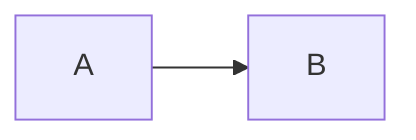

# Fonctionnalité : Bloc Plein Écran (Fullscreenable)

## Description
Le script `fullscreen-block.js` permet d'ajouter dynamiquement un bouton "Plein Écran" à l'intérieur de n'importe quel conteneur de la page. C'est particulièrement utile pour les diagrammes (Mermaid), les tableaux ou les grands blocs de code qui nécessitent un affichage élargi.

## Utilisation
Pour activer cette fonctionnalité sur un bloc de contenu, il suffit de l'envelopper avec une `<div>` possédant la classe `fullscreenable`.

Exemple (attention à l'attribut `markdown="1"` et aux lignes vides) :
```html
<div class="fullscreenable" markdown="1">



</div>
```

> [!WARNING]
> **Compatibilité Markdown (Kramdown)** : Si vous enveloppez du contenu Markdown (comme un bloc code ou mermaid) dans une balise HTML (`<div>`), Jekyll va ignorer le Markdown à l'intérieur. Vous **devez** ajouter l'attribut `markdown="1"` sur la div **ET** laisser une ligne vide avant et après le bloc de code.

## Fonctionnement technique
1. **Initialisation** : Le script JavaScript cherche tous les éléments `.fullscreenable` au chargement de la page.
2. **Injection du bouton** : Il injecte une icône SVG cliquable (en `position: absolute`) dans le coin supérieur droit du bloc. Par défaut, le bouton n'apparaît qu'au survol (hover) pour ne pas polluer l'interface.
3. **Plein écran** : Au clic, le script utilise l'API native `requestFullscreen()`.
4. **Styles CSS** : La classe `.fullscreenable:fullscreen` (définie dans `base.css`) s'assure que le fond devient blanc et que le contenu SVG s'étire (`max-width: 100%`) pour occuper tout l'écran.
5. **Basculement de l'icône** : Un écouteur sur l'événement `fullscreenchange` permet de modifier dynamiquement l'icône du bouton (Agrandir -> Réduire).
