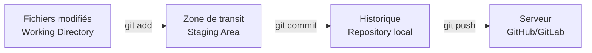

# Règles de rédaction - Domaine Git

Ce skill définit les règles spécifiques à appliquer lors de la rédaction ou de la modification de tutoriels appartenant au domaine de la gestion de versions avec Git (domaine C.151).

## 1. Commandes exécutables avec résultat attendu (Règle d'or)

**Chaque commande Git ou bash doit être accompagnée de son résultat terminal attendu.** L'apprenant doit savoir exactement ce qu'il verra dans son terminal après avoir exécuté la commande.

*   Utilisez un bloc `bash` pour la commande.
*   Utilisez un bloc `text` immédiatement après pour le résultat attendu.

**Exemple :**
```bash
git --version
```
```text
git version 2.43.0
```

> ❌ Ne jamais afficher une commande sans son résultat attendu si ce résultat est vérifiable.

## 2. Visualiser avec Mermaid

Les concepts Git (historique, branches, remotes) sont abstraits. **Utilisez systématiquement des diagrammes Mermaid** pour les rendre concrets.

*   Utilisez `gitGraph` pour les historiques de commits et les branches.
*   Utilisez `flowchart` pour les flux de travail (working dir → staging → repo).

**Exemple de flux Git :**


## 3. Contexte obligatoire pour chaque commande

Avant toute série de commandes, indiquez **dans quel contexte** elles s'exécutent :
*   Quel répertoire doit être ouvert dans le terminal ?
*   Le dépôt doit-il déjà exister (`git init` ou `git clone` préalable) ?

## 4. Pas de variables de remplacement sans exemple concret

Si une commande contient une valeur à remplacer (comme un nom d'utilisateur), donnez toujours un exemple concret juste après.

**Exemple :**
```bash
git config --global user.name "Votre Nom"
```
```bash
git config --global user.name "Madani Ali"
```

## 5. Structure pédagogique des tutoriels Git

*   **Théorie** : Expliquez le "pourquoi" en 1 à 3 sections max. Utilisez Mermaid pour montrer le concept.
*   **Pratique** : Guidez l'apprenant avec des étapes numérotées. Chaque étape contient UNE commande + son résultat attendu.
*   **Vérification** : Chaque série d'étapes doit se terminer par une commande de vérification (`git status`, `git log`, `git config --list`, etc.).

## Procédure de vérification du rédacteur

Avant de finaliser un tutoriel Git, posez-vous ces questions pour chaque commande :
> "Si l'apprenant copie-colle cette commande dans son terminal, que verra-t-il s'afficher ?"

Si vous ne montrez pas la réponse, le tutoriel est incomplet.
