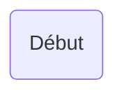
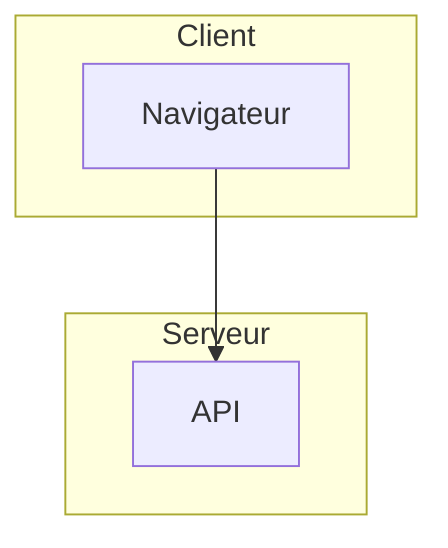

# Capacité : Diagrammes de Flux (Flowcharts) Mermaid

Ce document sert de référence technique pour la création de diagrammes de flux (Flowcharts) en utilisant Mermaid, basé sur la documentation officielle (https://mermaid.js.org/syntax/flowchart.html).

## 1. Déclaration de base
Un diagramme de flux est déclaré avec le mot-clé `flowchart` suivi de la direction :
- `TB` (Top to Bottom) ou `TD` (Top Down) : Haut vers bas
- `BT` (Bottom to Top) : Bas vers haut
- `RL` (Right to Left) : Droite vers gauche
- `LR` (Left to Right) : Gauche vers droite



## 2. Formes des nœuds (Nodes)
Les nœuds peuvent avoir différentes formes définies par les caractères qui entourent le texte :
- Nœud par défaut : `id1`
- Boîte rectangulaire : `id1[Texte]`
- Boîte avec coins arrondis : `id1(Texte)`
- Stade (Pillule) : `id1([Texte])`
- Sous-routine (Bords doubles) : `id1[[Texte]]`
- Base de données (Cylindre) : `id1[(Texte)]`
- Cercle : `id1((Texte))`
- Losange (Décision) : `id1{Texte}`
- Parallélogramme : `id1[/Texte/]` (ou `[\Texte\]`)
- Trapèze : `id1[/Texte\]` (ou `[\Texte/]`)

## 3. Liens (Links)
Pour relier les nœuds :
- Ligne continue avec flèche : `A --> B`
- Ligne continue sans flèche : `A --- B`
- Ligne pointillée avec flèche : `A -.-> B`
- Ligne épaisse avec flèche : `A ==> B`
- Ligne avec texte : `A -->|Texte| B` ou `A -- Texte --> B`
- Ligne pointillée avec texte : `A -.->|Texte| B`
- Chaînage multiple : `A --> B --> C`

## 4. Sous-graphes (Subgraphs)
Permettent de regrouper visuellement des nœuds :


## 5. Styles (Styling)
On peut appliquer du style directement à un nœud :
`style id1 fill:#f9f,stroke:#333,stroke-width:4px`

Ou utiliser des classes :
```mermaid
classDef className fill:#f96,stroke:#333,stroke-width:2px;
class id1 className;
```

## 6. Bonnes pratiques de génération
- Toujours vérifier la syntaxe et les fermetures de parenthèses/crochets.
- Utiliser les alias (ex: `A[Texte long]`) plutôt que d'écrire le texte long à chaque lien.
- Éviter d'utiliser des caractères spéciaux non échappés dans les noms de nœuds (utiliser les guillemets si besoin : `id1["Texte complexe (ex)"]`).
