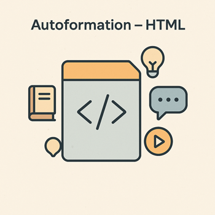

# Structurer le HTML

L’autoformation **2.1 – Structurer le HTML (11h)** permet de découvrir les bases du langage HTML5 et de savoir construire une page web **bien organisée, accessible et sémantique**.
Elle s’articule en trois UAs progressives :

* **UA 2.1.1 – Structurer une page HTML** : Découvrir la structure de base d’une page (titres, paragraphes, listes, tableaux).
* **UA 2.1.2 – Créer des formulaires accessibles** : Construire des formulaires complets et ergonomiques.
* **UA 2.1.3 – Produire un code HTML sémantique et optimisé** : Utiliser les balises modernes (header, nav, section, article, footer) et valider le code avec le W3C.

À la fin de cette autoformation, l’apprenant sera capable de :

1. Créer une page HTML complète et valide.
2. Organiser les contenus avec une structure logique.
3. Produire un code sémantique optimisé pour le référencement.

