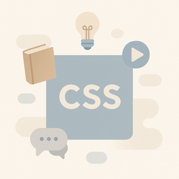

# Styliser avec CSS

L’autoformation **2.2 – Styliser avec CSS (16h)** permet à l’apprenant de passer de simples pages HTML à des interfaces **esthétiques, modernes et responsives**.
À travers cette autoformation, l’apprenant apprend à :

* Utiliser les **bases du CSS** (sélecteurs, cascade, typographie, couleurs),
* Créer des **mises en page professionnelles** avec **Flexbox** et **Grid**,
* Appliquer des **techniques avancées** (variables, media queries),
* Ajouter des **animations et transitions** pour enrichir l’expérience utilisateur,
* Découvrir des **outils modernes** comme **Bootstrap** pour accélérer la conception.

Cette autoformation est découpée en **5 UAs progressives** :

1. **UA 2.2.1 – Fondamentaux de la mise en forme (4h)**
2. **UA 2.2.2 – Mises en page modernes avec CSS (6h)**
3. **UA 2.2.3 – Techniques CSS avancées (3h)**
4. **UA 2.2.4 – Animation et transition (1h)**
5. **UA 2.2.5 – Outils CSS modernes (2h)**

