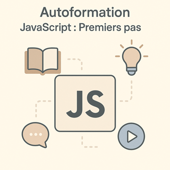

# 🎓 JavaScript : Premiers pas

JavaScript est le **langage de programmation incontournable du web**. Associé au HTML et au CSS, il permet de rendre les pages interactives, d’ajouter des comportements dynamiques et de réagir aux actions de l’utilisateur. Cette autoformation pose les **bases essentielles** de JavaScript pour comprendre sa syntaxe, manipuler le DOM et créer des interactions simples.

## **Pourquoi cette autoformation ?**

* **Compléter le duo HTML/CSS** pour créer des sites web dynamiques.
* **Développer la logique de programmation** avec des variables, des conditions et des boucles.
* **Introduire l’interaction** avec les éléments d’une page (DOM) et les événements.
* **Préparer les étapes avancées** comme l’utilisation d’APIs ou de frameworks JavaScript.

## **Objectifs pédagogiques**

À l’issue de cette autoformation, l’apprenant sera capable de :

1. Écrire des **instructions simples** en JavaScript et structurer son code.
2. Contrôler le **déroulement d’un script** avec des conditions et boucles.
3. Manipuler le **DOM** pour changer le contenu et la structure d’une page.
4. Gérer les **événements utilisateurs** pour rendre une interface interactive.

---

## **Unités d’Apprentissage (UAs) de l’autoformation 3.1**

Cette autoformation de **20h** est composée de **4 UAs**, chacune contenant 2 chapitres :

### **UA 3.1.1 – Écrire des instructions simples en JavaScript (5h)**

* Chapitre 1 : Variables, types de données, opérateurs.
* Chapitre 2 : Fonctions simples.

### **UA 3.1.2 – Contrôler le déroulement du code (5h)**

* Chapitre 3 : Conditions & logique booléenne.
* Chapitre 4 : Boucles (`for`, `while`, `break`).

### **UA 3.1.3 – Manipuler le DOM (5h)**

* Chapitre 5 : Sélecteurs DOM (`getElementById`, `querySelector`).
* Chapitre 6 : Modifier texte, attributs, classes.

### **UA 3.1.4 – Réagir aux actions utilisateur (5h)**

* Chapitre 7 : Gestion des événements (`click`, `input`, `submit`).
* Chapitre 8 : Interaction avec l’utilisateur.

