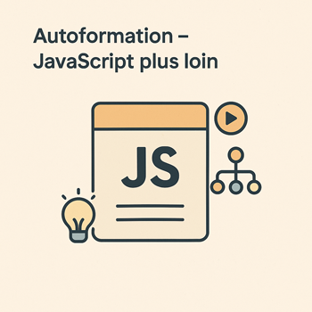

# 🎓 JavaScript : Aller plus loin

Après avoir acquis les **fondamentaux de JavaScript** dans l’autoformation 3.1, il est temps de franchir un **cap supérieur**. L’autoformation 3.2 permet à l’apprenant de **manipuler des données dynamiques**, d’**interagir avec des APIs**, d’**afficher des informations en temps réel**, et d’**organiser son code** de manière plus professionnelle et modulaire.

## **Pourquoi cette autoformation ?**

* **Approfondir la logique de programmation** avec des notions comme les callbacks et les fonctions imbriquées.
* **Gérer des données complexes** : objets imbriqués, tableaux de produits, données JSON.
* **Apprendre à consommer des APIs** pour afficher des données externes (météo, produits, etc.).
* **Structurer et optimiser le code** grâce aux fonctionnalités modernes d’ES6 (modules, fonctions fléchées, `let` et `const`).

## **Objectifs pédagogiques**

À la fin de cette autoformation, l’apprenant sera capable de :

1. **Interagir avec des APIs** en utilisant `fetch()` et manipuler des données JSON.
2. **Afficher dynamiquement des informations** dans le DOM selon des conditions et des filtres.
3. **Organiser son code** en modules réutilisables, avec de bonnes pratiques ES6.
4. **Gérer l’état d’une application** et manipuler des objets complexes pour construire des interfaces dynamiques.

---

## **Unités d’Apprentissage (UAs)**

Cette autoformation de **20h** est composée de **4 UAs**, chacune contenant 2 chapitres :

### **UA 3.2.1 – Interagir avec des APIs (5h)**

* Chapitre 1 : Appels AJAX avec `fetch()` & traitement JSON.
* Chapitre 2 : Parcourir et afficher les données d’une API.

### **UA 3.2.2 – Affichage dynamique des données (5h)**

* Chapitre 3 : Affichage conditionnel & logique d’affichage.
* Chapitre 4 : Rendu dynamique depuis des tableaux d’objets.

### **UA 3.2.3 – Organiser son code avec des concepts avancés (5h)**

* Chapitre 5 : Fonctions imbriquées, portée, callbacks.
* Chapitre 6 : Factorisation, modularisation et bonnes pratiques ES6.

### **UA 3.2.4 – Gérer l’état et les objets complexes (5h)**

* Chapitre 7 : Manipuler des objets imbriqués & tableaux.
* Chapitre 8 : Créer une interface interactive pilotée par état.

---

Souhaites-tu que je **génère le Chapitre 1 (Appels AJAX avec fetch & JSON)** avec le même format détaillé (objectifs, concepts, tutoriel, résumé) ?
