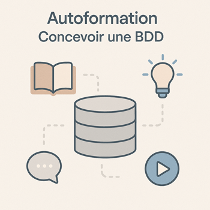

# 5.1 – Concevoir une base relationnelle

### 🏆 Compétence cible

**C5 – Créer une base de données (22h – Niveau 1)**
L’apprenant doit être capable de modéliser une base de données relationnelle et de créer une structure SQL cohérente, en respectant les bonnes pratiques de conception.

### 🧩 Micro-compétence

**5.1 – Concevoir une base relationnelle (12h)**
Analyser les besoins d’un projet, identifier les entités et leurs relations, et construire un modèle conceptuel et logique de données (MCD/MLD) avant de passer à l’implémentation SQL.

### 📝 Description de l’autoformation

Cette autoformation guide l’apprenant dans la **conception d’une base de données relationnelle** en partant des besoins réels d’un projet. Elle introduit les notions d’**entités, d’attributs et de relations**, et enseigne la création d’un **MCD (Modèle Conceptuel de Données)** et d’un **MLD (Modèle Logique de Données)**.
L’objectif final est de traduire ce modèle en **script SQL** complet pour créer une base fonctionnelle.

---

## UA 5.1.1 – Modéliser une base de données

1. **🎯 Objectif global**

   * Comprendre les concepts de modélisation relationnelle et créer un MCD/MLD pour un projet simple.

2. **📚 Liste des chapitres**

   * Chapitre 1 : Identifier les entités et relations (2h).
   * Chapitre 2 : Élaborer un MCD/MLD (2h).
   * Chapitre 3 : Manipuler un fichier de modélisation (2h).

3. **📄 Livrable attendu**

   * Réaliser un modèle conceptuel et logique (MCD/MLD) pour une base de données de blog (utilisateurs, articles, commentaires).

4. **🧪 Grilles d’évaluation**

   * **Niveau 1** : Identifier correctement les entités et relations.
   * **Niveau 2** : Construire un MCD/MLD cohérent.
   * **Niveau 3** : Produire un schéma complet prêt pour l’implémentation SQL.

---

## UA 5.1.2 – Créer une base de données SQL

1. **🎯 Objectif global**

   * Savoir créer une base de données relationnelle en SQL, avec des tables, des types de données et des contraintes.

2. **📚 Liste des chapitres**

   * Chapitre 4 : Créer des tables avec types et contraintes (2h).
   * Chapitre 5 : Écrire un script SQL de création complet (2h).
   * Chapitre 6 : Bonnes pratiques de structuration (2h).

3. **📄 Livrable attendu**

   * Rédiger un script SQL complet pour créer une base de données de blog (tables utilisateurs, articles, commentaires avec clés primaires et étrangères).

4. **🧪 Grilles d’évaluation**

   * **Niveau 1** : Créer une table simple avec des champs basiques.
   * **Niveau 2** : Ajouter des contraintes (PRIMARY KEY, FOREIGN KEY).
   * **Niveau 3** : Rédiger un script complet respectant les bonnes pratiques.

