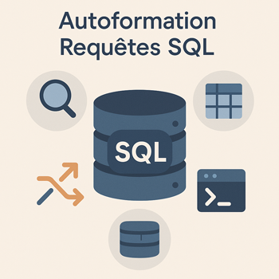

# 5.2 – Requêtes et manipulation SQL

### 🏆 Compétence cible

**C5 – Créer une base de données (22h – Niveau 1)**
L’apprenant doit être capable d’interroger, filtrer et manipuler des données dans une base relationnelle en utilisant le langage SQL, tout en respectant les bonnes pratiques.

### 🧩 Micro-compétence

**5.2 – Requêtes et manipulation SQL (10h)**
Maîtriser les commandes de base SQL (SELECT, INSERT, UPDATE, DELETE), utiliser les clauses de filtrage et les fonctions d’agrégation, et exécuter des jointures simples pour interroger efficacement une base de données.

### 📝 Description de l’autoformation

Cette autoformation approfondit l’utilisation du langage SQL à travers des requêtes de sélection, de filtrage, d’agrégation et de manipulation des données. L’apprenant apprendra à construire des requêtes optimisées et à modifier les données existantes dans une base de manière sécurisée.

---

## UA 5.2.1 – Rechercher des données efficacement

1. **🎯 Objectif global**

   * Savoir interroger une base de données avec des requêtes SELECT, trier et filtrer les résultats.

2. **📚 Liste des chapitres**

   * Chapitre 1 : SELECT, WHERE, ORDER BY (2h).
   * Chapitre 2 : Fonctions d’agrégation & GROUP BY (1.5h).
   * Chapitre 3 : Jointures simples (1.5h).

3. **📄 Livrable attendu**

   * Écrire un ensemble de requêtes SQL permettant d’afficher les articles d’un blog, filtrés par auteur et triés par date de publication.

4. **🧪 Grilles d’évaluation**

   * **Niveau 1** : Rédiger une requête SELECT avec un filtre simple.
   * **Niveau 2** : Utiliser GROUP BY et des fonctions d’agrégation.
   * **Niveau 3** : Réaliser des jointures entre plusieurs tables.

---

## UA 5.2.2 – Manipuler les données

1. **🎯 Objectif global**

   * Apprendre à insérer, modifier et supprimer des données dans une table SQL en respectant l’intégrité des données.

2. **📚 Liste des chapitres**

   * Chapitre 4 : INSERT INTO (1.5h).
   * Chapitre 5 : UPDATE, DELETE (2h).
   * Chapitre 6 : Bonnes pratiques + requêtes combinées (1.5h).

3. **📄 Livrable attendu**

   * Écrire un script SQL permettant d’ajouter un nouvel article, de mettre à jour un article existant, puis de supprimer un article donné.

4. **🧪 Grilles d’évaluation**

   * **Niveau 1** : Insérer des données dans une table.
   * **Niveau 2** : Modifier et supprimer des enregistrements.
   * **Niveau 3** : Écrire un script SQL combinant plusieurs opérations de manipulation.

