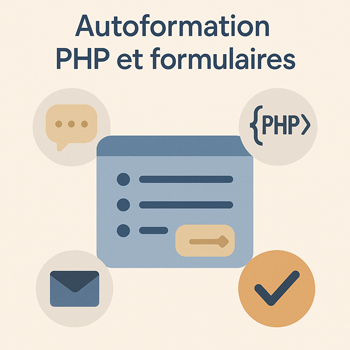

# Introduction – Formulaires et navigation sécurisée

### 🏆 Compétence cible

**C7 – Développer la partie back-end d’une application web (27h – Niveau 1)**
L’apprenant doit être capable de gérer la collecte et le traitement des données issues de formulaires HTML avec PHP, tout en mettant en place des mécanismes de session et de navigation sécurisée.

### 🧩 Micro-compétence

**7.2 – Formulaires et navigation sécurisée (6h)**
Traiter des formulaires HTML avec PHP, gérer les variables superglobales `$_GET` et `$_POST`, afficher des messages de validation, et utiliser les sessions et cookies pour une navigation sécurisée.

### 📝 Description de l’autoformation

Cette autoformation apprend à l’apprenant à créer et traiter des formulaires HTML via PHP, à gérer les erreurs et validations, et à utiliser les sessions et cookies pour sécuriser la navigation. L’objectif est de poser les bases de l’interaction utilisateur-serveur.

---

## UA 7.2.1 – Traitement des formulaires HTML

1. **🎯 Objectif global**

   * Savoir récupérer, valider et afficher les données envoyées via un formulaire HTML avec PHP.

2. **📚 Liste des chapitres**

   * Chapitre 1 : Récupération via `$_GET`, `$_POST`, validation simple (1.5h).
   * Chapitre 2 : Affichage conditionnel & messages d’erreur (1.5h).

3. **📄 Livrable attendu**

   * Créer un formulaire de contact (nom, e-mail, message) avec traitement PHP et affichage des messages de validation.

4. **🧪 Grilles d’évaluation**

   * **Niveau 1** : Récupérer des données via `$_POST`.
   * **Niveau 2** : Valider les champs et afficher des messages d’erreur.
   * **Niveau 3** : Mettre en place un traitement complet avec filtres et sécurité basique.

---

## UA 7.2.2 – Sessions et cookies

1. **🎯 Objectif global**

   * Gérer la persistance des données utilisateur avec les sessions et cookies, et sécuriser la navigation.

2. **📚 Liste des chapitres**

   * Chapitre 3 : Démarrer une session utilisateur (1h).
   * Chapitre 4 : Manipuler des cookies en PHP (1h).
   * Chapitre 5 : Sécuriser la navigation avec les sessions (1h).

3. **📄 Livrable attendu**

   * Créer un mini-système d’authentification (connexion/déconnexion) en utilisant les sessions et cookies.

4. **🧪 Grilles d’évaluation**

   * **Niveau 1** : Mettre en place une session basique.
   * **Niveau 2** : Utiliser des cookies pour stocker des informations simples.
   * **Niveau 3** : Sécuriser l’accès à des pages protégées avec sessions et cookies.

