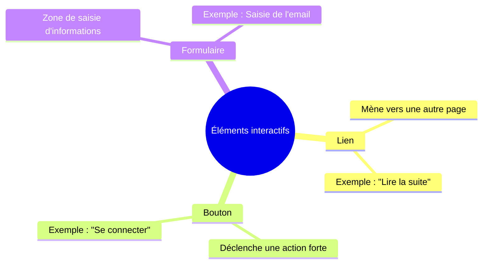

## 1. Objectif

À partir de la maquette du Blog, vous allez vous mettre à la place du **Visiteur** (l'utilisateur qui navigue sur le site). Votre objectif est de repérer toutes les actions qu'il peut effectuer en observant les éléments interactifs.

## 2. Prérequis

- Tutoriel T.111.112 terminé (l'acteur Visiteur est identifié).

**Cas d'étude — Maquette du Blog :** <a href="https://solicode-web-mobile.github.io/maquette-blog/index.html" target="_blank">Ouvrir la maquette</a>

## Partie 1 — Théorie

### 1.1. Les actions utilisateur et éléments interactifs

Une **action** est une opération que l'utilisateur peut réaliser sur une page web. Lors de l'analyse d'un besoin ou d'une maquette, on repère ces actions en observant les éléments interactifs à l'écran. 

On distingue trois grandes familles d'éléments interactifs :

**La règle de l'analyste :** Si un élément attire l'attention de la souris (le curseur change au survol), c'est qu'une action est possible pour l'utilisateur.

## Partie 2 — Pratique

### 2.1. Cartographier les actions du Visiteur sur le Blog

L'analyse ne se fait pas page par page de manière isolée, mais en parcourant l'ensemble de l'application pour cartographier le parcours complet de notre acteur Visiteur.

**Votre mission :** 
1. Ouvrez la maquette du Blog.
2. Naviguez sur l'ensemble des pages accessibles au Visiteur (Accueil, Liste des catégories, Détail d'un article, Page de connexion).
3. À chaque fois que vous repérez un élément interactif, posez-vous la question : *"Que peut faire le Visiteur ici ?"*

### 2.2. Travail à faire (Livrable)

Construisez un tableau récapitulatif pour classifier toutes les actions que vous avez repérées. Utilisez le format de tableau suivant (à remplir dans un document texte ou Markdown) :

| Page | Élément cliqué / rempli | Action du visiteur |
| :--- | :--- | :--- |
| Accueil | Lien "Catégories" dans le menu | Accéder à la liste des catégories |
| Accueil | ... | ... |

*Continuez ce tableau pour couvrir : les interactions sur la page d'accueil, la navigation par catégories, la lecture d'un article complet, et le formulaire de connexion.*

### Livrable attendu

Préparez un document structuré contenant votre tableau d'analyse complet.

### Critère de réussite

Le tableau doit répertorier de manière exhaustive tous les liens de navigation principaux, les interactions sur les articles (lire la suite), et la totalité des champs de saisie de la page de connexion.

**Résultat attendu :**

<iframe
    class="auto-wrapper"
    src="{{'/code/analyse/tuto-3-analyse.html' | relative_url}}"
    height="700"
    title="Résultat attendu">
</iframe>

## Bilan

**Vous savez maintenant :**
- Analyser visuellement une maquette pour en extraire des comportements d'usage.
- Distinguer les liens, les boutons et les formulaires pour comprendre l'intention fonctionnelle de l'utilisateur.
- Cartographier et structurer les actions brutes d'un acteur donné sous forme d'un tableau d'analyse.

## Glossaire

- **Action brute** : Opération observable et immédiate (cliquer, saisir, lire) qu'un acteur effectue sur une interface.
- **Élément interactif** : Composant de la page (lien, bouton, formulaire) conçu pour réagir à l'interaction de l'utilisateur.
