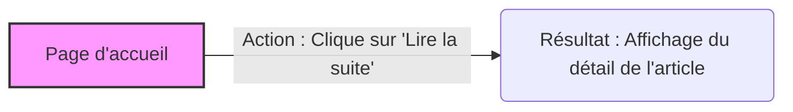

## 1. Objectif

Vous allez transformer les actions brutes du **Visiteur** identifiées précédemment en **fonctionnalités** formalisées. L'objectif est d'apprendre à parler le langage de l'analyste fonctionnel pour décrire clairement ce qu'une application doit faire.

## 2. Prérequis

- Tutoriel T.111.121 terminé (les actions brutes du Visiteur sont listées).

**Cas d'étude — Maquette du Blog :** <a href="https://solicode-web-mobile.github.io/maquette-blog/index.html" target="_blank">Ouvrir la maquette</a>

## Partie 1 — Théorie

### 1.1. De l'action à la fonctionnalité

Une **fonctionnalité** est la description métier d'un besoin. Contrairement à une action brute qui se concentre sur l'interface (ex: "cliquer sur un bouton"), la fonctionnalité se concentre sur l'intention (ex: "s'authentifier").

Pour l'écrire, on utilise une règle de nommage stricte : **Acteur + Action + Élément**.

| Élément | Définition | Exemple |
| :--- | :--- | :--- |
| **Acteur** | Qui réalise l'action ? | Le Visiteur |
| **Action** | Que fait-il ? (Verbe à l'infinitif ou conjugué) | consulte |
| **Élément** | Sur quel objet métier ? | le détail d'un article |

**Exemple de fonctionnalité :** « Le Visiteur consulte le détail d'un article. »

### 1.2. Le Parcours Fonctionnel

Une fonctionnalité isolée ne suffit pas toujours aux développeurs. Ils ont besoin de comprendre tout le cheminement de l'utilisateur : c'est le **parcours fonctionnel**.

Il modélise les étapes de la fonctionnalité sous la forme : **Écran de départ → Action → Résultat**.

## Partie 2 — Pratique

### 2.1. Élaborer la synthèse fonctionnelle du Blog

En tant qu'analyste, vous devez fournir une vue globale de ce que le Visiteur peut faire sur le Blog.

**Votre mission :** 
1. Reprenez le tableau des actions brutes du Visiteur que vous avez construit au tutoriel précédent.
2. Pour chaque groupe d'actions logiques, définissez la **fonctionnalité** correspondante en appliquant la règle de nommage (Acteur + Action + Élément).
3. Pour chaque fonctionnalité, décrivez son **parcours fonctionnel complet**.

### 2.2. Travail à faire (Livrable)

Construisez un tableau de **Synthèse fonctionnelle** pour l'acteur Visiteur. Ce document regroupera la totalité de son périmètre sur l'application. Utilisez le format de tableau suivant (à remplir dans un fichier texte ou Markdown) :

| Acteur | Fonctionnalité | Parcours fonctionnel (Départ -> Action -> Résultat) |
| :--- | :--- | :--- |
| Visiteur | Consulter la liste globale des articles | Accueil -> Navigation -> Affichage des articles récents |
| Visiteur | ... | ... |

*Continuez ce tableau pour couvrir les autres fonctionnalités (consultation par catégorie, consultation du détail d'un article, et authentification).*

### Livrable attendu

Préparez un document structuré (Markdown ou texte) contenant votre tableau de synthèse fonctionnelle complet.

### Critère de réussite

Toutes les fonctionnalités du Visiteur doivent être présentes et formulées correctement (Acteur + Action). Les parcours doivent clairement indiquer l'écran de départ et le résultat attendu pour chaque ligne.

**Résultat attendu :**

<iframe
    class="auto-wrapper"
    src="{{'/code/analyse/tuto-4-analyse.html' | relative_url}}"
    height="700"
    title="Résultat attendu">
</iframe>

## Bilan

**Vous savez maintenant :**
- Élever une action de l'interface vers une intention métier (la **fonctionnalité**).
- Appliquer la règle de nommage standardisée pour que tout le monde (client et développeurs) comprenne le besoin.
- Décrire le cheminement de l'utilisateur grâce au **parcours fonctionnel**.

## Glossaire

- **Fonctionnalité** : Intention métier formalisée selon la règle Acteur + Action + Élément.
- **Parcours fonctionnel** : Modélisation des étapes d'une fonctionnalité (Écran → Action → Résultat).
- **Synthèse fonctionnelle** : Document ou tableau qui récapitule l'ensemble des fonctionnalités du système.
