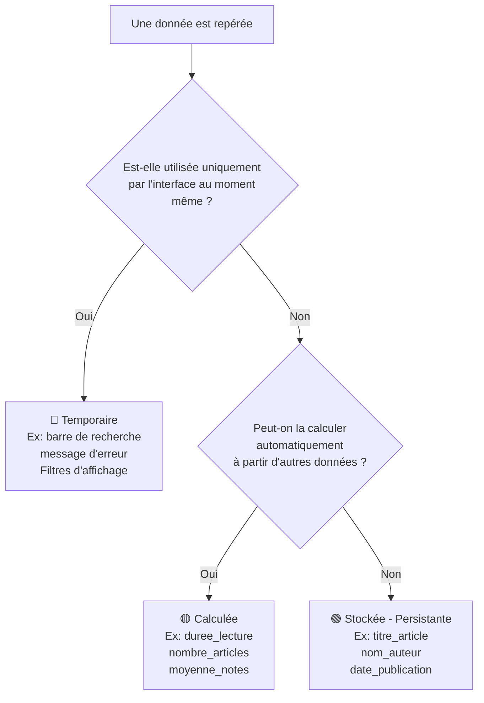

## Objectif

Apprendre à filtrer les données d'une application pour distinguer ce qui doit être stocké en base de données, ce qui peut être calculé, et ce qui est purement temporaire.

## Prérequis

- Tutoriel T.112.111 terminé (distinguer information, donnée et valeur).

## Partie 1 — Théorie

### 1.1. Le filtre de conception

Lorsque vous analysez une application, vous faites face à une multitude de données. Pourtant, **toutes ne doivent pas être enregistrées** dans la base de données. La question clé à se poser pour chaque donnée est :

> **"Cette donnée doit-elle être retrouvée demain par l'application ?"**

Ce filtre de conception vous oriente vers l'un des trois états possibles :

**Seules les données 🟢 Stockées seront conservées pour modéliser la base de données.**

## Partie 2 — Pratique

### 2.1. Classifier des données

Pour chaque donnée présentée dans le tableau ci-dessous, appliquez le filtre de conception et indiquez son état.

Choisissez parmi : `stockée`, `calculée`, `temporaire`.

| Donnée | Situation dans l'application | État de la donnée |
| :--- | :--- | :---: |
| `titre_article` | L'article est publié et enregistré en base | |
| `mot_cle` | L'utilisateur tape "Tutoriel" dans la barre de recherche | |
| `duree_lecture` | L'application compte les mots et déduit « 5 min » | |
| `date_publication` | L'application mémorise le jour où l'article a été posté | |
| `message_erreur` | Un texte rouge "Mot de passe incorrect" apparaît à l'écran | |

### Livrable attendu

Préparez un document Markdown contenant votre tableau complété.

**Résultat attendu :**

<button class="btn btn-primary btn-toggle-resultat">Afficher le résultat</button>
<iframe
    class="auto-wrapper tuto-resultat"
    src="{{ '/code/conception/T.112.121/' | relative_url }}"
    height="320"
    title="Résultat attendu — Données à conserver">
</iframe>

### Critère de réussite

Vous avez correctement distingué les 3 types de données : la donnée stockée (qui persiste dans le temps), la donnée calculée (déductible automatiquement), et la donnée temporaire (liée à l'interface).

## Bilan

**Vous savez maintenant :**
- Appliquer le filtre de conception (Temporaire → Calculée → Stockée) à toute donnée observée.
- Ignorer les éléments d'interface et les données déductibles lors de la conception d'une base de données.

## Glossaire

- **Donnée stockée (persistante)** : donnée essentielle à conserver dans le temps.
- **Donnée calculée** : donnée produite automatiquement à partir d'autres données.
- **Donnée temporaire** : donnée d'interface éphémère, à ignorer lors de la conception.
