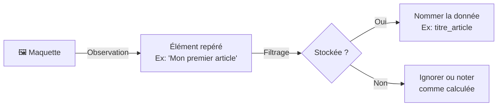

## Objectif

Observer la maquette du Blog, repérer les données qu'elle présente et les décrire dans un tableau structuré appelé **dictionnaire de données**.

## Prérequis

- Savoir distinguer une donnée de sa valeur (T.112.111).
- Maîtriser le filtre stockée / calculée / temporaire (T.112.121).

## Données de départ

**Cas d'étude — Page Détail d'un article — Maquette du Blog :**

👉 [Ouvrir la maquette du Blog](https://solicode-web-mobile.github.io/maquette-blog/index.html)

## Partie 1 — Théorie

### 1.1. Observer une maquette et identifier les données

Une maquette est une représentation visuelle d'un écran. Lors de la conception d'une base de données, on la parcourt pour en extraire toutes les **données stockées** (les données temporaires et calculées sont ignorées ou notées comme règles de calcul).

La démarche est simple :

**Règle de nommage :** Toujours utiliser des minuscules, des underscores `_` et pas d'accents. Préférez des noms explicites : `titre_article` plutôt que `titre` ou `champ1`.

### 1.2. Décrire une donnée : le dictionnaire

Une fois les données identifiées et nommées, on les décrit dans un **dictionnaire de données**. Chaque ligne du tableau représente une donnée et répertorie 6 informations essentielles :

| Donnée | Description | Exemple de valeur | Type | Obligatoire | Calculée |
| :--- | :--- | :--- | :--- | :---: | :---: |
| `titre_article` | Titre de l'article | Mon premier article | Texte | Oui | Non |
| `duree_lecture` | Durée estimée en minutes | 5 | Entier | Non | **Oui** |

**Types conceptuels disponibles :** `Texte`, `Entier`, `Nombre décimal`, `Date`, `Booléen`.

> **Rappel :** Une donnée `Calculée: Oui` (comme `duree_lecture`) ne sera **pas stockée** en base de données.

## Partie 2 — Pratique

### 2.1. Identifier et décrire les données de la page Détail

Ouvrez la maquette du Blog sur la **page Détail d'un article**.

**Votre mission :**
1. Parcourez la page et repérez tous les éléments qui présentent une donnée (texte, image, date, chiffre…).
2. Pour chaque donnée repérée, appliquez le filtre (stockée / calculée / temporaire).
3. Construisez votre dictionnaire de données en remplissant le tableau ci-dessous avec au minimum **6 données**.

### 2.2. Travail à faire (Livrable)

Complétez ce tableau dans un document Markdown ou Google Docs :

| Donnée | Description | Exemple de valeur | Type | Obligatoire | Calculée |
| :--- | :--- | :--- | :--- | :---: | :---: |
| | | | | | |
| | | | | | |
| | | | | | |
| | | | | | |
| | | | | | |
| | | | | | |

### Livrable attendu

Un fichier `dictionnaire-donnees-T112122.md` contenant votre tableau complété.

**Résultat attendu :**

<button class="btn btn-primary btn-toggle-resultat">Afficher le résultat</button>
<iframe
    class="auto-wrapper tuto-resultat"
    src="{{ '/code/conception/T.112.122/' | relative_url }}"
    height="420"
    title="Résultat attendu — Dictionnaire de données">
</iframe>

### Critère de réussite

- Au moins 6 données identifiées à partir de la maquette.
- Chaque donnée a un nom clair (convention `snake_case`), une description, un exemple de valeur et un type cohérent.
- Les données calculées sont correctement signalées.

## Bilan

**Vous savez maintenant :**
- Observer une maquette avec un filtre de conception pour en extraire les données persistantes.
- Nommer et typer chaque donnée de manière standardisée.
- Construire un dictionnaire de données structuré.

Dans le prochain tutoriel, vous apprendrez à **regrouper les données de plusieurs maquettes** pour constituer le dictionnaire de données complet de l'application.

## Glossaire

- **Dictionnaire de données** : Tableau qui répertorie et décrit toutes les données d'une application (nom, type, description, etc.).
- **Type conceptuel** : Nature du contenu d'une donnée (Texte, Date, Entier…), indépendant du stockage technique.
- **Donnée facultative** : Donnée qui peut ne pas avoir de valeur (son champ peut rester vide).
