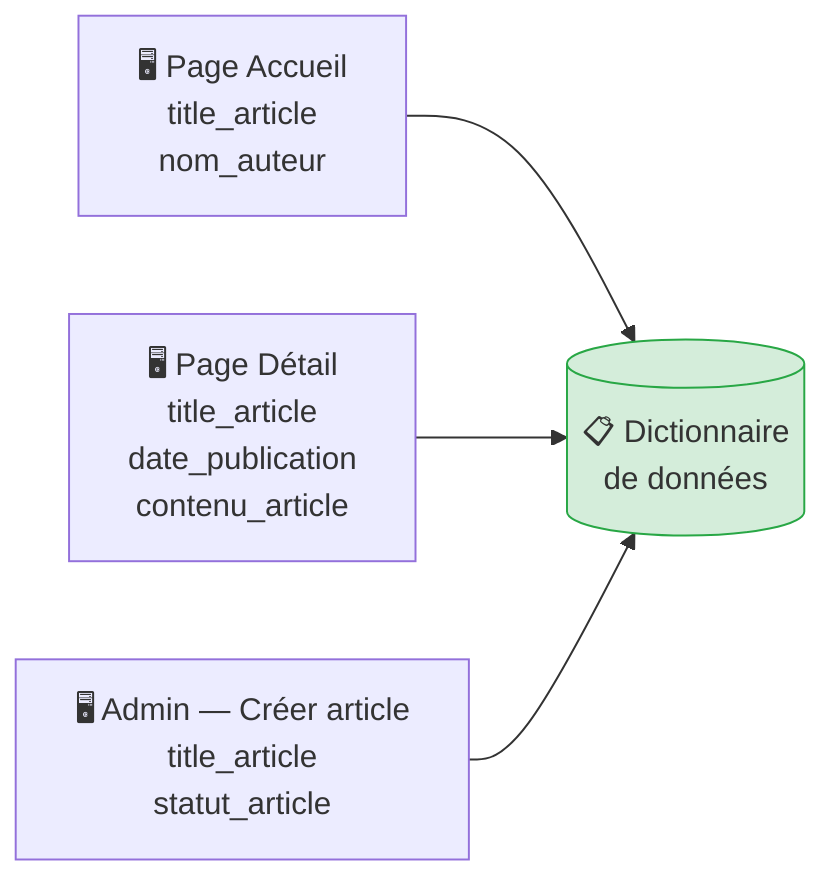

## Objectif

Analyser **l'ensemble des maquettes du Blog** pour construire un **dictionnaire de données** complet et cohérent, sans doublon.

## Prérequis

- Savoir identifier et décrire une donnée dans une maquette (T.112.122).

## Données de départ

**Cas d'étude — Toutes les maquettes du Blog :**

👉 [Ouvrir les maquettes du Blog](https://solicode-web-mobile.github.io/maquette-blog/index.html)

Explorez toutes les pages disponibles (partie publique et partie administration).

## Partie 1 — Théorie

### 1.1. Du multi-maquettes au dictionnaire unique

Au tutoriel précédent, vous avez décrit les données d'une seule page. Une application complète comporte plusieurs pages, et les **mêmes données y apparaissent plusieurs fois** (ex: `titre_article` est visible sur la page d'accueil, sur la page de détail, et dans l'interface d'administration).

La règle du dictionnaire est simple : **chaque donnée n'y apparaît qu'une seule fois**, quelle que soit le nombre de pages sur lesquelles elle est présente.

`titre_article` apparaît sur 3 pages → **1 seule ligne dans le dictionnaire**.

### 1.2. Rappel des règles de structuration

| Règle | ✅ Correct | ❌ Incorrect |
| :--- | :--- | :--- |
| **Nommage** `snake_case` | `titre_article` | `TitreArticle`, `titre article`, `data1` |
| **Type** | `Texte`, `Entier`, `Décimal`, `Date`, `Booléen` | `String`, `int`, `VARCHAR` |
| **Obligatoire** | `Oui` ou `Non` (ou `À déterminer`) | Laisser vide |
| **Calculée** | `Oui` (avec règle de calcul) ou `Non` | Laisser vide |

> **Rappel :** Les données **temporaires** (barre de recherche, messages d'erreur) ne figurent jamais dans le dictionnaire.

## Partie 2 — Pratique

### 2.1. Analyser toutes les maquettes du Blog

**Votre mission :**
1. Naviguez sur **toutes les pages** disponibles dans les maquettes (Accueil, Catégories, Détail d'un article, Connexion, Administration).
2. Pour chaque page, notez les données que vous repérez.
3. Fusionnez vos notes : éliminez les doublons et harmonisez les noms en `snake_case`.

**Points d'attention par page :**
- **Page Admin / Créer un article** → repérez `statut_article` (Publié / Brouillon).
- **Page Connexion Admin** → repérez `email_admin` et `mot_de_passe_admin`.
- **Pages Catégories** → repérez `description_categorie` s'il est présent.

### 2.2. Travail à faire (Livrable)

Construisez le dictionnaire de données final et complet du Blog. Votre tableau doit couvrir toutes les données persistantes de l'application : les articles, les auteurs, les catégories, et la connexion.

| Donnée | Description | Exemple de valeur | Type | Obligatoire | Calculée |
| :--- | :--- | :--- | :--- | :---: | :---: |
| | | | | | |

### Livrable attendu

Un fichier `dictionnaire-donnees-blog.md` contenant votre tableau complet.

**Résultat attendu :**

<button class="btn btn-primary btn-toggle-resultat">Afficher le résultat</button>
<iframe
    class="auto-wrapper tuto-resultat"
    src="{{ '/code/conception/T.112.123/' | relative_url }}"
    height="600"
    title="Résultat attendu — Dictionnaire de données complet">
</iframe>

### Critère de réussite

- Toutes les maquettes ont été analysées.
- Aucune donnée n'est répétée (pas de doublon).
- Les noms respectent la convention `snake_case`.
- Les colonnes Type, Obligatoire et Calculée sont renseignées pour chaque ligne.

## Bilan

**Vous savez maintenant :**
- Analyser plusieurs maquettes pour en extraire l'ensemble des données persistantes.
- Fusionner les données récurrentes en une seule ligne sans doublon.
- Construire un dictionnaire de données de référence pour toute l'équipe.

Dans le prochain tutoriel, vous apprendrez à **regrouper ces données en Entités** pour construire le Modèle Conceptuel de Données (MCD).

## Glossaire

- **Dictionnaire de données** : Tableau de référence listant toutes les données persistantes d'une application, sans doublon.
- **Doublon** : Donnée inscrite plusieurs fois dans le dictionnaire. À éliminer systématiquement.
