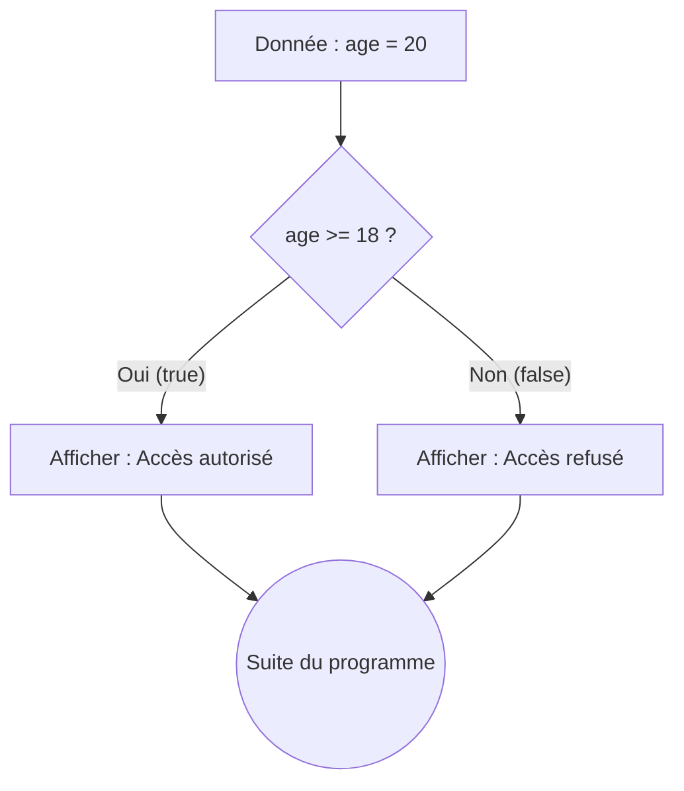

## 1. Objectif

Apprendre à utiliser les **conditions** pour contrôler le comportement de votre programme. Une condition permet à l'ordinateur de prendre des décisions selon les données reçues, de la même façon que nous prenons des décisions au quotidien (ex: "S'il pleut, je prends un parapluie").

## 2. Prérequis

* Utilisation de variables et de `console.log()`.
* Maîtrise des opérateurs de comparaison (`===`, `>`, `<`, etc.).

## Partie 1 — Théorie

### 1.1. Agir sous condition (`if` / `else`)

Une condition demande à l'ordinateur de vérifier une règle. Si la règle est vraie (`true`), il exécute un bloc de code. Sinon, il peut exécuter un bloc alternatif grâce à `else`.

```javascript
let age = 20;
if (age >= 18) {
    console.log("Accès autorisé"); // Exécuté si vrai
} else {
    console.log("Accès refusé"); // Exécuté si faux
}
```



### 1.2. Gérer plusieurs cas successifs (`else if`)

Lorsqu'il y a plus de deux issues possibles, on enchaîne avec `else if`. 
L'ordinateur lit de haut en bas et **s'arrête dès qu'une condition est vraie**. Il faut donc toujours écrire de la règle la plus spécifique à la plus générale.

```javascript
let note = 14;
if (note >= 16) {
    console.log("Très bien");
} else if (note >= 10) {
    console.log("Validé");
} else {
    console.log("Non validé");
}
```

### 1.3. Combiner des règles (`&&` / `||`)

Plutôt que d'écrire plusieurs `if` imbriqués, on regroupe les règles avec des opérateurs logiques :
* **Le ET logique (`&&`)** : **Toutes** les conditions doivent être vraies.
* **Le OU logique (`||`)** : **Au moins une** des conditions doit être vraie.

```javascript
let age = 20;
let inscrit = true;

// Les deux doivent être vrais
if (age >= 18 && inscrit === true) {
    console.log("Accès membre");
}

let membre = false;
let invitation = true;

// L'un des deux suffit
if (membre === true || invitation === true) {
    console.log("Entrée VIP");
}
```

## Partie 2 — Pratique

### 2.1. Les alternatives (`if`, `else if`, `else`)

Dans votre fichier `conditions.js`, implémentez les logiques suivantes et testez-les en changeant les valeurs initiales.

1.  **Vérification de l'âge** : 
    Affichez "Vous êtes majeur" si l'âge est supérieur ou égal à 18, sinon affichez "Vous êtes mineur". Testez avec `age = 15` et `age = 20`.
2.  **Le signe d'un nombre** :
    Déclarez une variable `nombre = 7`. Affichez "Positif" s'il est supérieur à 0, sinon "Négatif ou nul". Testez avec `7`, `-3`, et `0`.

### 2.2. Les conditions multiples (`&&`, `||`)

Déclarez les variables suivantes :
```javascript
let membre = false;
let invitation = true;
let a = 12;
let b = 8;
```

1.  **Accès contrôlé** : Autorisez l'accès (affichez "Bienvenue") si la personne est membre **OU** si elle a une invitation. Testez différentes combinaisons (`true/true`, `false/true`, `false/false`).
2.  **Trouver le maximum** : Affichez la valeur de la plus grande des deux variables `a` ou `b`. Essayez avec `a=5; b=13` puis `a=10; b=10`.

### 2.3. Travail à faire (Livrable)

1.  Définissez une variable `score = 15`.
2.  Créez un bloc conditionnel complet pour afficher :
    *   "Excellent" si la note est de 16 ou plus.
    *   "Réussi" si la note est entre 10 et 15 inclus.
    *   "Échec" si la note est en dessous de 10.
3.  Modifiez la valeur de `score` pour tester les trois cas de figure et vérifiez que seul le bon message s'affiche à chaque fois.

### Livrable

Préparez un document (Markdown ou Google Doc) contenant votre code final de l'exercice 2.3, ainsi que les captures d'écran des 3 tests exécutés.

### Critère de réussite

Utilisation appropriée de `if`, `else if` et `else`. Le programme affiche la bonne mention sans exécuter les autres cas. L'ordre des conditions est respecté.

### Résultat attendu

* Pour `score = 17` → `Excellent`
* Pour `score = 12` → `Réussi`
* Pour `score = 7` → `Échec`

## Bilan

**Vous savez maintenant :**
* Créer des branchements logiques avec `if` et `else` pour gérer les cas d'erreur ou d'alternative.
* Traiter une succession de cas avec `else if`.
* Combiner plusieurs critères dans une même vérification avec `&&` et `||`.

## Glossaire

* **Condition** : Règle qui permet à l'ordinateur de décider s'il doit exécuter un bloc de code.
* **Bloc** : Instructions contenues entre accolades `{ }` liées à une condition.
