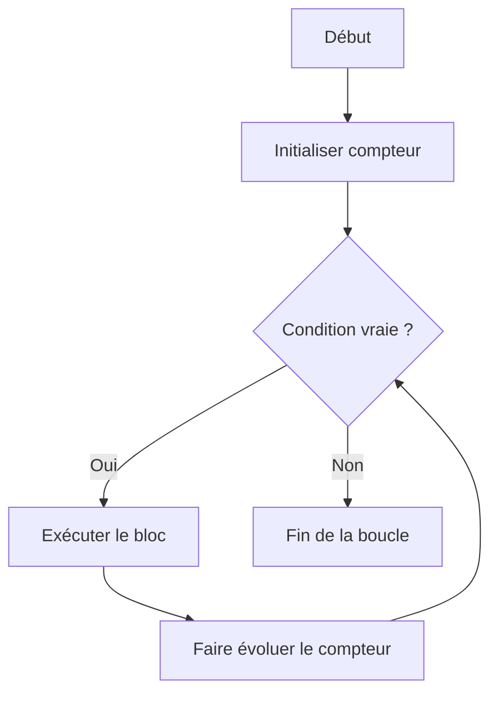

## 1. Objectif

Apprendre à **répéter une action automatiquement** en programmation grâce aux boucles `for` et `while`.

## 2. Prérequis

* Variables et `console.log()`.
* Conditions `if` (tutoriel précédent).

## Partie 1 — Théorie

### 1.1. Le principe d'une boucle

Une boucle permet à l'ordinateur de répéter un bloc de code sans avoir à le dupliquer. Elle repose sur 3 éléments : un **compteur** (on sait où on en est), une **condition de répétition** (on sait si on continue), et une **évolution** (on avance vers la fin).



> ⚠️ Sans évolution du compteur, la boucle tourne à l'infini et plante le programme.

### 1.2. La boucle `for` — quand on sait combien de fois

La boucle `for` regroupe les 3 éléments sur une seule ligne : `(initialisation; condition; évolution)`.

```javascript
for (let compteur = 1; compteur <= 5; compteur++) {
    console.log(compteur);
}
// Affiche : 1, 2, 3, 4, 5
```

* `let compteur = 1` → on démarre à 1
* `compteur <= 5` → on continue tant que le compteur n'a pas dépassé 5
* `compteur++` → on ajoute 1 à chaque tour

### 1.3. La boucle `while` — quand on ne sait pas combien de fois

La boucle `while` (« tant que ») est plus libre. Elle répète tant que la condition est vraie. On gère le compteur soi-même.

```javascript
let compteur = 1;
while (compteur <= 5) {
    console.log(compteur);
    compteur++; // ← ne pas oublier !
}
// Affiche : 1, 2, 3, 4, 5
```

### 1.4. Combiner boucle et condition

On peut placer un `if` à l'intérieur d'une boucle pour **filtrer les résultats** à chaque tour.

```javascript
for (let nombre = 1; nombre <= 10; nombre++) {
    if (nombre % 2 === 0) {
        console.log(nombre); // Affiche uniquement 2, 4, 6, 8, 10
    }
}
```

## Partie 2 — Pratique

### 2.1. Explorer `for` et `while`

Dans un fichier `boucles.js`, testez et comparez ces deux boucles. Elles produisent le même résultat.

**Avec `for` :**
```javascript
for (let i = 1; i <= 5; i++) {
    console.log(i);
}
```

**Avec `while` :**
```javascript
let i = 1;
while (i <= 5) {
    console.log(i);
    i++;
}
```

1. Modifiez la limite pour aller jusqu'à `10`.
2. Changez la valeur de départ pour partir de `3`.
3. Remplacez `i++` par `i--` dans une boucle `for` qui part de `5` pour faire un compte à rebours jusqu'à `1`.

### 2.2. Boucle et condition imbriquées (Livrable)

Écrivez un programme complet qui :
1. Parcourt les nombres de `1` à `10`.
2. N'affiche que les **nombres pairs** grâce à un `if` à l'intérieur de la boucle.
3. Testez votre programme et vérifiez le résultat.

### Critère de réussite

La boucle s'arrête correctement et n'affiche que les nombres pairs.

### Résultat attendu

```text
2
4
6
8
10
```

## Bilan

**Vous savez maintenant :**
* Construire une boucle `for` (comptage précis) et une boucle `while` (condition libre).
* Gérer un compteur et définir une condition d'arrêt.
* Imbriquer un `if` dans une boucle pour filtrer les résultats.

## Glossaire

* **Boucle** : Structure répétant un bloc d'instructions.
* **Compteur** : Variable qui suit le nombre d'itérations.
* **Itération** : Un tour complet à l'intérieur de la boucle.
* **Condition d'arrêt** : La règle qui met fin à la boucle.
