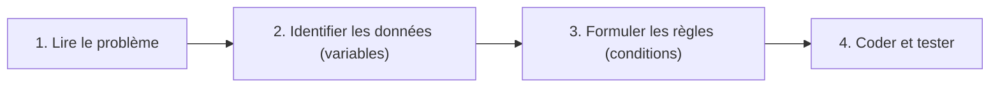

## 1. Objectif

Consolider l'utilisation des **conditions** en résolvant des problèmes concrets en JavaScript.

## 2. Prérequis

* Variables, `console.log()`, opérateurs de comparaison (`>`, `<`, `===`).
* Structures `if`, `else if`, `else` et opérateurs logiques `&&`, `||`.

## Méthode de résolution

Pour chaque exercice, suivez ces 4 étapes :



## Partie — Pratique

### Exercice 1 — Résultat d'un apprenant (`else if`)

**Contexte :** Un apprenant a obtenu une note. Votre programme doit afficher sa mention.

**Règles :**
* `>= 16` → "Très bien"
* `>= 10` → "Validé"
* `< 10` → "Non validé"

**Travail :** Écrivez le programme complet et testez-le avec au moins 3 valeurs : `8`, `12`, `17`.

```javascript
let note = 12; // ← modifiez cette valeur pour tester
// Votre code ici...
```

> ❓ Pourquoi faut-il vérifier `note >= 16` **avant** `note >= 10` ?

---

### Exercice 2 — Classification d'une température (`else if` avec ordre critique)

**Contexte :** Vous devez afficher une description selon la température extérieure.

**Règles :**
* `< 10` → "Froid"
* `< 25` → "Doux"
* `>= 25` → "Chaud"

**Travail :** Écrivez le programme et testez avec `5`, `15`, `24`, `25`, `30`.

```javascript
let temperature = 28; // ← modifiez cette valeur pour tester
// Votre code ici...
```

---

### Exercice 3 — Validation d'un apprenant (`&&`)  ← Livrable

**Contexte :** Pour valider un module, un apprenant doit réunir deux conditions en même temps.

**Règles :** note `>= 10` **ET** présence `>= 80` → "Validé", sinon "Non validé".

**Travail :**
1. Déclarez `let note = 14;` et `let presence = 90;`.
2. Écrivez la condition combinée avec `&&`.
3. Testez les 4 combinaisons : (14, 90), (14, 70), (8, 90), (8, 70).

```javascript
let note = 14;
let presence = 90; // ← modifiez ces valeurs pour tester
// Votre code ici...
```

### Critère de réussite

Les conditions sont logiques, l'ordre de priorité est respecté, et le bon message s'affiche pour chaque jeu de test.

### Résultat attendu (Exercice 3)

| note | presence | Résultat |
|------|----------|----------|
| 14 | 90 | Validé |
| 14 | 70 | Non validé |
| 8 | 90 | Non validé |
| 8 | 70 | Non validé |

## Bilan

**Vous savez maintenant :**
* Modéliser un problème avec des conditions `if / else if / else`.
* Combiner plusieurs règles avec `&&` dans une même décision.
* Respecter l'ordre des conditions pour obtenir le bon résultat.

## Glossaire

* **Condition** : Règle qui détermine le chemin d'exécution du programme.
* **Test** : Exécution du programme avec une valeur précise pour vérifier son comportement.
