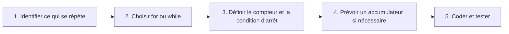

## 1. Objectif

Consolider l'utilisation des **boucles** en résolvant des problèmes concrets : filtrer, compter et accumuler des valeurs.

## 2. Prérequis

* Structures `for` et `while`, opérateur `++` / `--`.
* Condition `if` dans une boucle.

## Méthode de résolution



> 💡 **L'accumulateur** est une variable qui grandit à chaque tour de boucle (ex: `somme = somme + nombre`). Il doit être initialisé **avant** la boucle.

## Partie — Pratique

### Exercice 1 — Filtrer avec une boucle (`for` + `if`)

**Contexte :** Parcourez les nombres de 1 à 20 et affichez uniquement les **nombres pairs**.

**Travail :**
1. Écrivez une boucle `for` de 1 à 20.
2. À l'intérieur, ajoutez un `if` pour ne garder que les nombres pairs (`nombre % 2 === 0`).
3. Testez — vous devez voir apparaître 2, 4, 6… 20.

```javascript
// Squelette de départ
for (let nombre = 1; nombre <= 20; nombre++) {
    // Votre condition ici...
}
```

**Résultat attendu :**
```text
2
4
6
8
10
12
14
16
18
20
```

---

### Exercice 2 — Calculer une somme (accumulateur)

**Contexte :** Calculez la somme de tous les nombres de 1 à 10.

**Travail :**
1. Déclarez un accumulateur `let somme = 0;` **avant** la boucle.
2. À chaque tour, ajoutez la valeur du compteur à `somme`.
3. Après la boucle, affichez le résultat.

```javascript
let somme = 0;
for (let i = 1; i <= 10; i++) {
    // Votre code ici...
}
console.log(somme);
```

**Résultat attendu :** `55`

> ❓ Que se passerait-il si vous mettiez `let somme = 0;` **à l'intérieur** de la boucle ?

---

### Exercice 3 — Synthèse : compter ET sommer ← Livrable

**Contexte :** Parcourez les nombres de 1 à 20. En une seule boucle, trouvez **à la fois** le nombre de chiffres pairs et leur somme totale.

**Travail :**
1. Déclarez `let compteur = 0;` et `let somme = 0;` avant la boucle.
2. À chaque tour, si le nombre est pair : incrémentez `compteur` de 1 et ajoutez-le à `somme`.
3. Affichez les deux résultats après la boucle.

```javascript
let compteur = 0;
let somme = 0;
// Votre boucle ici...
console.log("Nombre de pairs : " + compteur);
console.log("Somme des pairs : " + somme);
```

**Résultat attendu :**
```text
Nombre de pairs : 10
Somme des pairs : 110
```

### Critère de réussite

Les boucles s'arrêtent correctement, les accumulateurs sont placés hors de la boucle, et les bonnes valeurs s'affichent.

## Bilan

**Vous savez maintenant :**
* Filtrer les valeurs d'une boucle avec un `if` intégré.
* Utiliser un **accumulateur** pour construire un résultat progressif (somme, comptage).
* Combiner filtre et accumulation dans une même boucle.

## Glossaire

* **Accumulateur** : Variable initialisée avant la boucle, mise à jour à chaque itération pour conserver un résultat global.
* **Itération** : Un tour complet à l'intérieur de la boucle.
* **Filtrage** : Sélection de certaines valeurs uniquement via un `if` dans la boucle.
