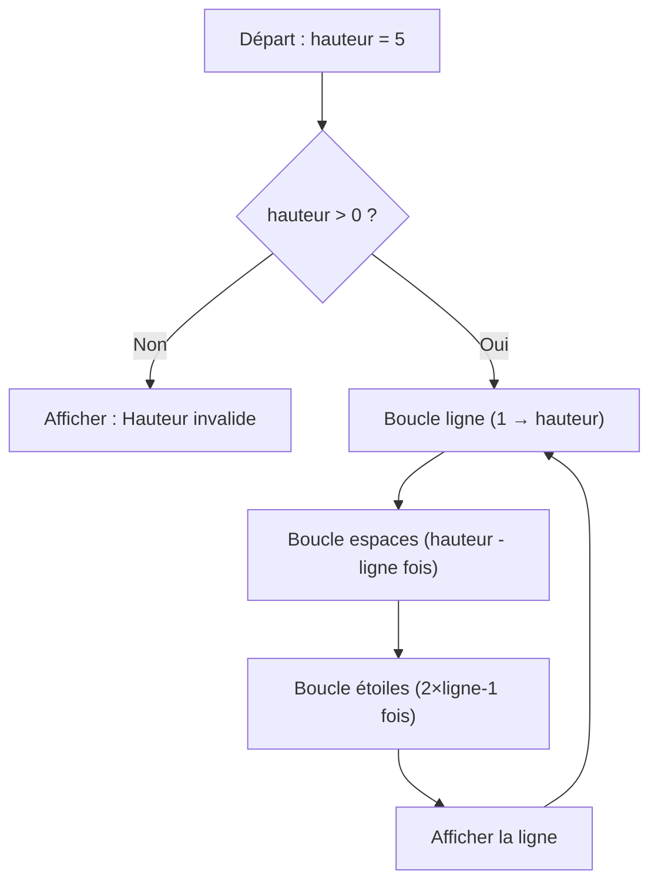

## 1. Objectif

Construire un **algorithme complet** combinant variables, boucles imbriquées et conditions pour afficher une pyramide d'étoiles symétrique.

```text
    *
   ***
  *****
 *******
*********
```

## 2. Prérequis

* Boucles `for` et imbrication de boucles.
* Condition `if / else`.
* Concaténation de chaînes : `ligneTexte = ligneTexte + "*"`.

## Partie 1 — Théorie

### 1.1. Décortiquer une ligne de la pyramide

Chaque ligne contient **des espaces** (pour centrer) suivis **d'étoiles**. Pour une pyramide de hauteur 5 :

| Ligne | Espaces (`hauteur - ligne`) | Étoiles (`2 × ligne - 1`) |
|-------|-----------------------------|--------------------------|
| 1 | 4 | 1 (`*`) |
| 2 | 3 | 3 (`***`) |
| 3 | 2 | 5 (`*****`) |
| 4 | 1 | 7 (`*******`) |
| 5 | 0 | 9 (`*********`) |

> Les deux formules sont la clé de tout l'algorithme.

### 1.2. La structure de l'algorithme

L'algorithme utilise 3 boucles imbriquées et une condition de sécurité :



### 1.3. La technique de construction d'une ligne

On construit la ligne comme une chaîne de caractères, puis on l'affiche d'un coup :

```javascript
let ligneTexte = ""; // Réinitialisé à chaque ligne !
ligneTexte = ligneTexte + " "; // Ajouter un espace
ligneTexte = ligneTexte + "*"; // Ajouter une étoile
console.log(ligneTexte);       // Afficher la ligne complète
```

## Partie 2 — Pratique

Construisez le programme en 4 étapes progressives dans un fichier `pyramide.js`.

### Étape 1 — Construire une ligne avec une boucle

Écrivez une boucle qui ajoute 5 étoiles dans `ligneTexte` et affiche le résultat.

```javascript
let ligneTexte = "";
for (let e = 1; e <= 5; e++) {
    ligneTexte = ligneTexte + "*";
}
console.log(ligneTexte); // Affiche : *****
```

---

### Étape 2 — Générer un triangle simple (boucles imbriquées)

Ajoutez une boucle principale pour les lignes. Faites varier le nombre d'étoiles selon la ligne.

```javascript
for (let ligne = 1; ligne <= 5; ligne++) {
    let ligneTexte = "";
    for (let e = 1; e <= ligne; e++) {   // "ligne" étoiles
        ligneTexte = ligneTexte + "*";
    }
    console.log(ligneTexte);
}
```

---

### Étape 3 — Ajouter les espaces (pyramide centrée)

Ajoutez une boucle pour les espaces **avant** la boucle des étoiles. Appliquez les deux formules mathématiques.

```javascript
for (let ligne = 1; ligne <= 5; ligne++) {
    let ligneTexte = "";
    // Espaces
    for (let s = 1; s <= 5 - ligne; s++) {
        ligneTexte = ligneTexte + " ";
    }
    // Étoiles
    for (let e = 1; e <= (2 * ligne) - 1; e++) {
        ligneTexte = ligneTexte + "*";
    }
    console.log(ligneTexte);
}
```

---

### Étape 4 — Finaliser avec une variable et une condition ← Livrable

Remplacez `5` par une variable `hauteur` et ajoutez une condition de sécurité. Testez avec `hauteur = 7`, `3`, et `0`.

```javascript
let hauteur = 5;

if (hauteur > 0) {
    for (let ligne = 1; ligne <= hauteur; ligne++) {
        let ligneTexte = "";
        for (let s = 1; s <= hauteur - ligne; s++) {
            ligneTexte = ligneTexte + " ";
        }
        for (let e = 1; e <= (2 * ligne) - 1; e++) {
            ligneTexte = ligneTexte + "*";
        }
        console.log(ligneTexte);
    }
} else {
    console.log("Hauteur invalide.");
}
```

### Critère de réussite

La pyramide est parfaitement centrée et symétrique. Le programme affiche "Hauteur invalide." pour `hauteur = 0` ou une valeur négative.

### Résultat attendu

Pour `hauteur = 3` :
```text
  *
 ***
*****
```

Pour `hauteur = 5` :
```text
    *
   ***
  *****
 *******
*********
```

## Bilan

**Vous savez maintenant :**
* Analyser un motif visuel et en déduire des règles mathématiques (`hauteur - ligne`, `2 × ligne - 1`).
* Imbriquer des boucles pour gérer deux dimensions (hauteur et largeur).
* Structurer un algorithme complet en liant variables, conditions et boucles imbriquées.

## Glossaire

* **Algorithme** : Suite d'instructions logiques permettant de résoudre un problème.
* **Boucle imbriquée** : Une boucle contenue à l'intérieur d'une autre boucle.
* **Concaténation** : Assemblage de chaînes de caractères avec `+`.
