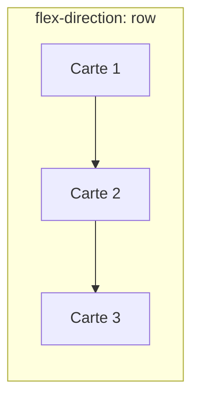
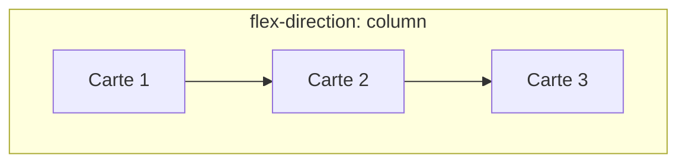

<script>
window.pageData = {
    html: {{ page.data_html | default: "" | jsonify }},
    css: {{ page.data_css | default: "" | jsonify }},
    js: {{ page.data_js | default: "" | jsonify }},
    php: {{ page.data_php | default: "" | jsonify }}
};
</script>

## 1. Objectif

Apprendre à choisir la direction des éléments dans un conteneur Flexbox avec `flex-direction`.

## 2. Prérequis

Vous savez déjà créer un conteneur Flexbox avec `display: flex`.

## Données de départ

*(Les données de départ sont chargées automatiquement dans l'éditeur de code de l'interface).*

### HTML

```html
<section class="liste-cartes">

    <article class="carte-article">
        <h2>HTML</h2>
        <p>Créer la structure d'une page web.</p>
    </article>

    <article class="carte-article">
        <h2>CSS</h2>
        <p>Mettre en forme une page web.</p>
    </article>

    <article class="carte-article">
        <h2>JavaScript</h2>
        <p>Ajouter des comportements à une page.</p>
    </article>

</section>
```


## Partie 1 — Théorie

### 1.1. L'axe principal avec `flex-direction`

Par défaut, Flexbox aligne les éléments horizontalement. La propriété `flex-direction` (à appliquer sur le conteneur) permet de changer ce comportement.




- `flex-direction: row;` (par défaut) : Organise les éléments sur une **ligne** (horizontalement, de gauche à droite).
- `flex-direction: column;` : Organise les éléments dans une **colonne** (verticalement, de haut en bas).

## Partie 2 — Pratique

### 2.1. Manipuler la direction des cartes

1. **Préparation :**
   - Ajoutez une 4ème carte en HTML (ex: PHP) dans `<section class="liste-cartes">`.
   - Ajoutez le CSS de base pour styliser vos cartes et le conteneur :
  
```css
.carte-article {
    width: 220px;
    padding: 20px;
    background: white;
    border: 1px solid #e5e7eb;
    border-radius: 12px;
}

.liste-cartes {
    display: flex;
    max-width: 900px;
    margin: 40px auto;
    padding: 20px;
    background: #f9fafb;
}
```

1. **Testez la direction `column` :**
   - Ajoutez `flex-direction: column;` sur le conteneur `.liste-cartes`. Constatez que les cartes s'empilent verticalement.

2. **Revenez à la direction `row` :**
   - Remplacez par `flex-direction: row;`. Les cartes reprennent leur position horizontale en ligne.

**Livrable :**

Créez un document avec le code CSS complet de `.liste-cartes` en utilisant `flex-direction: column;`.

**Résultat attendu :**

<button class="btn btn-primary btn-toggle-resultat">Afficher le résultat</button>
<iframe
    class="auto-wrapper tuto-resultat"
    src="{{'/code/css/tuto-122-232-css.html' | relative_url}}"
    height="350"
    title="Résultat attendu">
</iframe>

**Critère de réussite :**
Le conteneur utilise `display: flex` et `flex-direction: row`. Les éléments s'affichent horizontalement.

## Bilan

**Vous avez appris :**
- À utiliser `flex-direction` pour définir l'axe d'alignement principal (`row` ou `column`).

## Glossaire

- **`flex-direction`** : Propriété du conteneur définissant l'axe principal (direction des éléments).
- **`row`** : Direction en ligne (horizontal).
- **`column`** : Direction en colonne (vertical).