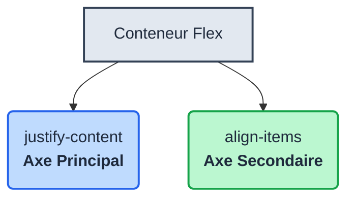

<script>
window.pageData = {
    html: {{ page.data_html | default: "" | jsonify }},
    css: {{ page.data_css | default: "" | jsonify }},
    js: {{ page.data_js | default: "" | jsonify }},
    php: {{ page.data_php | default: "" | jsonify }}
};
</script>

## 1. Objectif

Apprendre à aligner les éléments sur l’axe secondaire d’un conteneur Flexbox en utilisant la propriété `align-items`.

## 2. Prérequis

Vous savez déjà :
- utiliser `flex-direction` (Axe principal) ;
- utiliser `justify-content` (Répartition sur l'axe principal).


## Partie 1 — Théorie

### 1.1. L'axe principal vs. L'axe secondaire

Dans Flexbox, il y a toujours deux axes perpendiculaires. Leur orientation dépend de `flex-direction`.

- Avec `flex-direction: row;` (par défaut) :
  - **Axe principal** = Horizontal (géré par `justify-content`)
  - **Axe secondaire** = Vertical (géré par `align-items`)

- Avec `flex-direction: column;` :
  - **Axe principal** = Vertical
  - **Axe secondaire** = Horizontal



### 1.2. Aligner avec `align-items`

Tout comme `justify-content`, la propriété `align-items` (appliquée au conteneur) possède des valeurs clés pour positionner les éléments sur l'axe secondaire :

<svg viewBox="0 0 300 150" width="800px" height="auto" xmlns="http://www.w3.org/2000/svg">
  <defs>
    <rect id="card" width="40" height="30" rx="4" fill="#10b981" />
    <rect id="container" width="80" height="120" rx="4" fill="#f8fafc" stroke="#cbd5e1" stroke-width="2" />
  </defs>

  <!-- flex-start -->
  <g transform="translate(10, 0)">
    <text x="40" y="12" font-family="sans-serif" font-size="12" font-weight="bold" fill="#334155" text-anchor="middle">flex-start</text>
    <use href="#container" x="0" y="20" />
    <use href="#card" x="20" y="26" />
  </g>

  <!-- center -->
  <g transform="translate(110, 0)">
    <text x="40" y="12" font-family="sans-serif" font-size="12" font-weight="bold" fill="#334155" text-anchor="middle">center</text>
    <use href="#container" x="0" y="20" />
    <use href="#card" x="20" y="65" />
  </g>

  <!-- flex-end -->
  <g transform="translate(210, 0)">
    <text x="40" y="12" font-family="sans-serif" font-size="12" font-weight="bold" fill="#334155" text-anchor="middle">flex-end</text>
    <use href="#container" x="0" y="20" />
    <use href="#card" x="20" y="104" />
  </g>
</svg>

- **`flex-start`** : Aligne les éléments au début de l'axe secondaire (en haut, pour `row`).
- **`center`** : Centre les éléments sur l'axe secondaire (au milieu verticalement, pour `row`).
- **`flex-end`** : Aligne les éléments à la fin de l'axe secondaire (en bas, pour `row`).

**Exemple d'utilisation dans le code CSS :**
```css
.liste-cartes {
    display: flex;
    /* Aligne les cartes au centre de la hauteur du conteneur */
    align-items: center; 
}
```

## Partie 2 — Pratique (Projet Fil Rouge)

### 2.1. Centrer verticalement le menu

Avez-vous remarqué que dans votre page de blog, le logo, les liens et le bouton de la navigation ne sont pas tout à fait alignés verticalement ? Le logo est un peu plus grand, ce qui donne l'impression que le texte des liens "flotte" vers le haut. Corrigeons cela sur l'axe secondaire !

1. **Testez l'alignement sur le menu :**
   - Ouvrez votre fichier `css/layout.css` et repérez la règle `.barre-navigation`.
   - Ajoutez `align-items: flex-end;` et observez le résultat. Tous les éléments s'alignent vers le bas de la barre.
   - Remplacez par `align-items: center;`. Parfait ! Le logo, le texte des liens et le bouton sont désormais parfaitement alignés au centre vertical de la barre de navigation.

**Livrable :**

Votre fichier `css/layout.css` mis à jour, contenant la propriété `align-items: center;` appliquée sur `.barre-navigation`.

**Résultat attendu :**

<button class="btn btn-primary btn-toggle-resultat">Afficher le résultat</button>
<iframe
    class="auto-wrapper tuto-resultat"
    src="{{'/code/css/tuto-122-234-css.html' | relative_url}}"
    height="350"
    title="Résultat attendu">
</iframe>

**Critère de réussite :**
Les éléments de la barre de navigation sont parfaitement centrés verticalement sur l'axe secondaire.

## Bilan

**Vous avez appris :**
- À faire la distinction entre l'axe principal et l'axe secondaire.
- À utiliser `align-items` pour aligner les éléments sur l'axe secondaire.
- À combiner `justify-content` et `align-items` pour centrer parfaitement vos éléments.

## Glossaire

- **Axe secondaire** : Axe perpendiculaire à l'axe principal.
- **`align-items`** : Propriété Flexbox qui gère l'alignement des éléments sur l'axe secondaire.