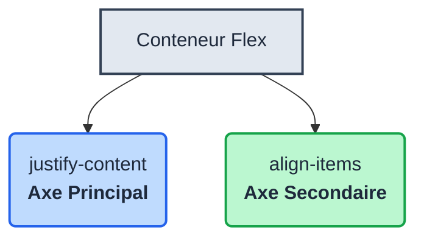

<script>
window.pageData = {
    html: {{ page.data_html | default: "" | jsonify }},
    css: {{ page.data_css | default: "" | jsonify }},
    js: {{ page.data_js | default: "" | jsonify }},
    php: {{ page.data_php | default: "" | jsonify }}
};
</script>

## 1. Objectif

Apprendre à aligner les éléments sur l’axe secondaire d’un conteneur Flexbox en utilisant la propriété `align-items`.

## 2. Prérequis

Vous savez déjà :
- utiliser `flex-direction` (Axe principal) ;
- utiliser `justify-content` (Répartition sur l'axe principal).

## Données de départ

*(Les données de départ sont chargées automatiquement dans l'éditeur de code de l'interface).*

### HTML

```html
<section class="liste-cartes">

    <article class="carte-article">
        <h2>HTML</h2>
        <p>Créer la structure d'une page web.</p>
    </article>

    <article class="carte-article">
        <h2>CSS</h2>
        <p>Mettre en forme une page web.</p>
    </article>

    <article class="carte-article">
        <h2>JavaScript</h2>
        <p>Ajouter des comportements à une page.</p>
    </article>

</section>
```

## Partie 1 — Théorie

### 1.1. L'axe principal vs. L'axe secondaire

Dans Flexbox, il y a toujours deux axes perpendiculaires. Leur orientation dépend de `flex-direction`.

- Avec `flex-direction: row;` (par défaut) :
  - **Axe principal** = Horizontal (géré par `justify-content`)
  - **Axe secondaire** = Vertical (géré par `align-items`)

- Avec `flex-direction: column;` :
  - **Axe principal** = Vertical
  - **Axe secondaire** = Horizontal



### 1.2. Aligner avec `align-items`

Tout comme `justify-content`, la propriété `align-items` (appliquée au conteneur) possède des valeurs clés pour positionner les éléments sur l'axe secondaire :
- `flex-start` : Aligne les éléments au début de l'axe secondaire (en haut, pour `row`).
- `center` : Centre les éléments sur l'axe secondaire (au milieu verticalement, pour `row`).
- `flex-end` : Aligne les éléments à la fin de l'axe secondaire (en bas, pour `row`).

## Partie 2 — Pratique

### 2.1. Centrer les éléments sur les deux axes

1. **Préparation :**
   Appliquez le CSS de base. Notez l'ajout de `height: 260px;` sur le conteneur pour rendre l'alignement vertical bien visible (le conteneur sera plus haut que les cartes).
```css
.carte-article {
    width: 180px;
    padding: 20px;
    background: white;
    border: 1px solid #e5e7eb;
    border-radius: 12px;
}

.liste-cartes {
    display: flex;
    flex-direction: row;
    width: 800px;
    height: 260px;
    max-width: 100%;
    margin: 40px auto;
    padding: 20px;
    background: #f9fafb;
}
```

2. **Testez l'alignement :**
   - Ajoutez `align-items: flex-start;` au conteneur. Observez que les cartes se placent tout en haut.
   - Remplacez par `align-items: center;`. Les cartes se centrent verticalement.

3. **Centrage parfait :**
   - Ajoutez ensuite `justify-content: center;` pour centrer les cartes à la fois horizontalement et verticalement dans votre conteneur.

**Livrable :**

Créez un document contenant le code CSS complet de `.liste-cartes` avec le centrage absolu (horizontal et vertical).

**Résultat attendu :**

<button class="btn btn-primary btn-toggle-resultat">Afficher le résultat</button>
<iframe
    class="auto-wrapper tuto-resultat"
    src="{{'/code/css/tuto-122-234-css.html' | relative_url}}"
    height="350"
    title="Résultat attendu">
</iframe>

**Critère de réussite :**
Le conteneur utilise `display: flex`, `justify-content: center` et `align-items: center`. Les cartes sont centrées horizontalement et verticalement dans la zone grise de 260px de haut.

## Bilan

**Vous avez appris :**
- À faire la distinction entre l'axe principal et l'axe secondaire.
- À utiliser `align-items` pour aligner les éléments sur l'axe secondaire.
- À combiner `justify-content` et `align-items` pour centrer parfaitement vos éléments.

## Glossaire

- **Axe secondaire** : Axe perpendiculaire à l'axe principal.
- **`align-items`** : Propriété Flexbox qui gère l'alignement des éléments sur l'axe secondaire.