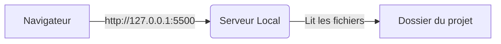

<script>
window.pageData = {
    html: {{ page.data_html | default: "" | jsonify }},
    css: {{ page.data_css | default: "" | jsonify }},
    js: {{ page.data_js | default: "" | jsonify }},
    php: {{ page.data_php | default: "" | jsonify }}
};
</script>

## 1. Objectif

Dans ce tutoriel, vous allez apprendre à démarrer un serveur Web local pour un site HTML/CSS en utilisant Visual Studio Code. Vous ouvrirez votre projet avec une adresse Web locale (ex: `http://127.0.0.1:5500`) pour visualiser vos modifications en temps réel.

## 2. Prérequis

- Savoir créer et relier des fichiers HTML et CSS.
- Savoir ouvrir un projet dans Visual Studio Code.

## Données de départ

Créez un dossier pour votre projet avec les deux fichiers suivants.

### HTML (`index.html`)

```html
<!DOCTYPE html>
<html lang="fr">
<head>
    <meta charset="UTF-8">
    <title>Mon blog</title>
    <link rel="stylesheet" href="style.css">
</head>
<body>
    <header>
        <h1>Mon blog</h1>
    </header>
    <main>
        <h2>Bienvenue</h2>
        <p>Découvrez mon blog.</p>
    </main>
</body>
</html>
```

### CSS (`style.css`)

```css
body {
    font-family: Arial, sans-serif;
    margin: 0;
    padding: 20px;
}
header {
    margin-bottom: 20px;
}
h1 {
    color: #333;
}
```

## Partie 1 — Théorie

### 1.1. Adresse fichier vs Serveur local

Lorsque vous ouvrez un fichier HTML directement (en double-cliquant), le navigateur affiche l'adresse `file:///`. Dans ce mode, le fichier n'est pas vu comme faisant partie d'un site Web, et certaines fonctionnalités avancées sont bloquées.

Un **serveur local** distribue vos fichiers comme le ferait un vrai serveur Web, mais directement depuis votre machine. L'adresse commence alors par `http://`.



- **`127.0.0.1`** (ou `localhost`) : C'est l'adresse IP de *votre propre machine*.
- **`5500`** : C'est le **port**, un identifiant utilisé par le serveur local pour recevoir les requêtes.

### 1.2. L'extension Live Server

**Live Server** est une extension pour Visual Studio Code qui permet de démarrer instantanément un serveur local.
Son grand avantage est de **recharger automatiquement** la page du navigateur à chaque fois que vous sauvegardez une modification dans votre code.

## Partie 2 — Pratique

### 2.1. Installation

1. Lancez **Visual Studio Code** et ouvrez le dossier de votre projet (qui contient `index.html` et `style.css`).
2. Ouvrez la vue **Extensions** de VS Code.
3. Recherchez **Live Server** et installez l'extension.

### 2.2. Démarrage

1. Ouvrez le fichier `index.html` dans l'éditeur.
2. Cliquez sur le bouton **Go Live** situé en bas à droite dans la barre d'état (ou faites un clic droit dans le code et choisissez "Open with Live Server").
3. Votre navigateur par défaut s'ouvre sur une adresse du type `http://127.0.0.1:5500/index.html`. Vérifiez que l'adresse commence bien par `http://` et non `file:///`.

### 2.3. Test en direct

1. Dans `index.html`, remplacez le titre `<h1>Mon blog</h1>` par `<h1>Mon blog personnel</h1>`.
2. Sauvegardez le fichier.
3. Observez le navigateur : la page s'est mise à jour toute seule ! Faites la même chose avec `style.css` (ex: changez la couleur du `h1` en `#555`) et sauvegardez.

### 2.4. Livrable de l'exercice

**Travail à faire :**

Reproduisez l'ensemble de ces étapes sur votre propre projet local pour le rendre accessible via une adresse Web locale.

**Livrable :**

Le dépôt GitHub de votre projet, contenant les fichiers `index.html` et `style.css` mis à jour suite à vos tests.

**Résultat attendu :**

Le navigateur affiche votre page avec la bonne adresse et reflète les modifications de style, sans nécessiter de rechargement manuel.

<button class="btn btn-primary btn-toggle-resultat">Afficher le résultat</button>
<iframe
    class="auto-wrapper tuto-resultat"
    src="{{'/code/deploy/T.141.11.1.html' | relative_url}}"
    height="450"
    title="Résultat attendu">
</iframe>

## Bilan

**Vous avez appris :**
- La différence entre l'ouverture directe d'un fichier (`file:///`) et l'utilisation d'un serveur Web local (`http://`).
- Le rôle d'une adresse IP locale (`127.0.0.1`) et d'un port (ex: `5500`).
- À installer et utiliser l'extension Live Server pour développer plus rapidement.

## Glossaire

- **Serveur local** : Programme qui fournit des fichiers Web depuis votre machine.
- **127.0.0.1 / localhost** : Adresse désignant la machine sur laquelle vous travaillez.
- **Live Server** : Extension VS Code qui démarre un serveur local et actualise le navigateur automatiquement.