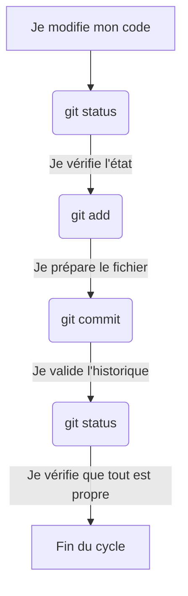

## 1. Objectif

Maîtriser le cycle de sauvegarde local avec Git. Vous apprendrez à utiliser le terminal pour préparer et valider vos modifications de code de manière autonome.

## 2. Prérequis

- Avoir compris les 3 zones de Git (Dossier de travail, Préparation, Historique).
- Avoir un dépôt Git local initialisé avec au moins un fichier `index.html`.

## Partie 1 — Théorie

### 1.1. Le cycle de travail local

Pour enregistrer définitivement une modification dans Git, vous devez exécuter une séquence de trois commandes fondamentales :



1. **`git status`** : C'est la commande la plus importante. Elle agit comme un radar. Elle vous dit exactement dans quelle zone se trouvent vos fichiers (modifiés, préparés ou propres). Vous l'utiliserez avant et après chaque action.
2. **`git add`** : Elle prend une modification du *Dossier de travail* et la place dans la *Zone de préparation*.
3. **`git commit`** : Elle prend tout ce qui se trouve dans la *Zone de préparation* et crée une sauvegarde permanente dans le *Dépôt Git*.

## Partie 2 — Pratique

*Contexte : Ouvrez votre terminal dans le dossier de votre projet. Assurez-vous d'avoir modifié votre fichier `index.html` (ex: ajout d'un titre).*

### 2.1. Vérifier, préparer et valider

Exécutez ce cycle dans l'ordre :

**Étape 1 : Vérifier l'état**
```bash
git status
```
```text
Sur la branche main
Fichiers modifiés :
  (utilisez "git add <fichier>..." pour mettre à jour ce qui sera validé)
        modifié :   index.html
```

**Étape 2 : Préparer la modification**
```bash
git add index.html
```
*(Cette commande n'affiche rien si elle réussit, mais le fichier est maintenant prêt).*

**Étape 3 : Créer le commit**
N'oubliez pas d'inclure un message explicite !
```bash
git commit -m "Ajout du titre principal dans index.html"
```
```text
[main 7b3a1c2] Ajout du titre principal dans index.html
 1 file changed, 1 insertion(+)
```

**Étape 4 : Vérifier que le cycle est terminé**
```bash
git status
```

```text
Sur la branche main
rien à valider, la copie de travail est propre
```
*(Si "working tree clean" ou "copie de travail est propre" s'affiche, c'est réussi !)*

### 2.2. Livrable de l'exercice

**Travail à faire :**
Reproduisez ce cycle complet dans votre propre terminal. 

**Livrable :**
Conformément à nos règles de progression :
1. Créez un fichier `commandes.md` à la racine de votre projet.
2. Écrivez à l'intérieur la liste des commandes que vous venez de taper (`git status`, `git add`, `git commit`).
3. Refaites un cycle pour ajouter ce fichier `commandes.md` et assurez-vous qu'il figure sur votre **dépôt GitHub**.
*(Aucune capture d'écran n'est demandée).*

**Résultat attendu final (dans votre terminal) :**

<button class="btn btn-primary btn-toggle-resultat">Afficher le résultat</button>
<iframe
    class="auto-wrapper tuto-resultat"
    src="{{'/code/git/T.151.122.html' | relative_url}}"
    height="350"
    title="Résultat de la console Git">
</iframe>

## Bilan

**Vous avez appris :**
- À utiliser `git status` comme un radar pour comprendre où en sont vos fichiers.
- À passer un fichier dans la zone de préparation avec `git add`.
- À graver un fichier dans l'historique avec `git commit`.

## Glossaire

- **`git status`** : Affiche l'état des 3 zones de Git.
- **`git add`** : Prépare un fichier pour le prochain commit.
- **`git commit`** : Valide la préparation et l'enregistre avec un message.
